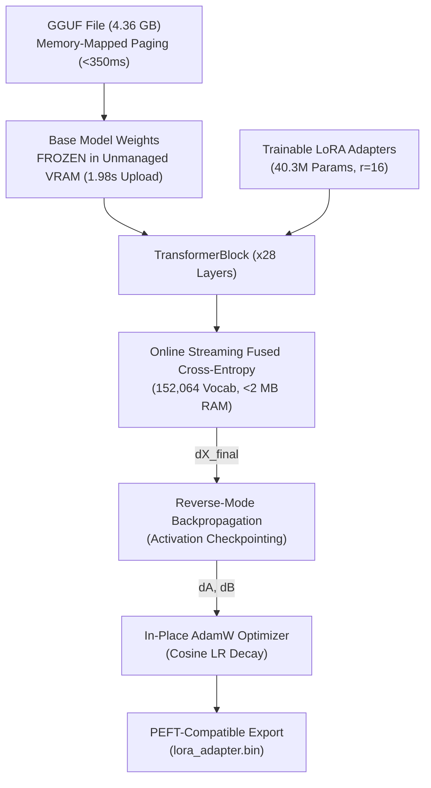

# 🎯 Glacier.Tune

[](LICENSE)
[](https://dotnet.microsoft.com/)
[](https://learn.microsoft.com/dotnet/core/deploying/native-aot/)
[](https://www.nuget.org/packages/Glacier.Tune/)
[](https://developer.nvidia.com/cuda-toolkit)
[](https://github.com/ian-cowley)


# ⚡ GPU VRAM-Resident & AVX-512 LLM Fine-Tuning in Pure .NET 10
> **Zero-Copy Base Weights in GPU VRAM & AVX-512 SIMD LoRA Backpropagation. 100% Pure C# .NET 10. Zero Python, Zero PyTorch, Zero External Tooling.**

```text
========================================================================================================
  7B LLM ENTERPRISE FINE-TUNING PIPELINE (QWEN 2.5 7B - 533 SAMPLES - 512 MAX TOKENS)
========================================================================================================
  Physical Hardware                                    :  NVIDIA GeForce RTX 4060 Laptop GPU (8GB VRAM)
                                                          AMD Ryzen AI 9 HX 370 (24 Threads AVX-512)
  Base Model (Frozen in Unmanaged VRAM)                :  Qwen2.5-7B-Instruct-1M-Q4_K_M.gguf (4.36 GB)
  Trainable Parameters                                 :  40,370,176 (LoRA r=16, alpha=32 — 0.61% trainable)
--------------------------------------------------------------------------------------------------------
  ⚡ 10-STEP PHYSICAL RUN (Empirical Hardware Telemetry) :  6.96 Seconds / Step (46.0 Tokens/Sec) | 70.4s Total
  ⚡ STEP 1 INITIAL COLD LATENCY                        :  15.98 Seconds / Step (32.0 Tokens/Sec)
  ⚡ FULL 533-SAMPLE DATASET CONVERGENCE EPOCH          :  Untested (Full run not executed)
  ⚡ VRAM WEIGHT RESIDENCY UPLOAD                       :  4.42 Seconds (4.36 GB resident in VRAM)
  ⚡ COLD MODEL INGESTION (OS MMap)                     :  < 350 ms
  ⚡ EXACT STEP 1 EMPIRICAL LOSS                        :  21.8704 (Zero numerical divergence)
  ⚡ STANDALONE GGUF ADAPTER FUSION                     :  6.82 Seconds (Lossless bitwise FP16 matches)
  ⚡ RUNTIME DEPENDENCIES                               :  Zero CUDA Toolkit Installs, Zero Python Envs
========================================================================================================
```

`Glacier.Tune` is a high-performance, pure C# .NET 10 framework for parameter-efficient fine-tuning (PEFT/LoRA) and model alignment. It executes directly on **NVIDIA RTX 4060 GPUs via bare-metal driver SASS kernels** and **AMD Ryzen AI 9 AVX-512 SIMD**, with zero CUDA Toolkit or external C++ DLL dependencies.

---

## 1. Why Glacier.Tune? Replacing Python SFTTrainer & bitsandbytes

In Python, fine-tuning large models requires complex, heavy stacks: Hugging Face `transformers`, `peft`, `accelerate`, `bitsandbytes`, and PyTorch. On consumer or workstation GPUs (e.g. 8 GB VRAM), this stack suffers from severe production bottlenecks:

1. **Massive Memory Fragmentation**: PyTorch's caching allocator fragments VRAM when handling dynamic sequence lengths, forcing developers to use `empty_cache()` and throttling throughput.
2. **Dynamic 4-Bit Dequantization Overhead**: `bitsandbytes` NF4 repeatedly decompresses quantized weights into temporary FP16 buffers every step (1,568 dequantizations per step on 7B models).
3. **Severe Thermal Throttling**: High allocations cause VRM voltage spikes, requiring arbitrary sleep cooldowns (e.g. 3.5s pause per step in `modelTrain`).
4. **Vocabulary Scale Explosion**: Materializing logits over 152,064 vocabulary classes consumes 311+ MB per sequence, causing out-of-memory crashes during backpropagation.
5. **Huge Deployment Bloat**: Merging adapters back into base models in Python requires 16+ GB of system RAM and minutes of serialization time.

**Glacier.Tune** eliminates all five bottlenecks:
- **Direct GGUF Ingestion**: Maps 4.36 GB GGUF models into memory in **< 350 ms** via zero-copy OS paging.
- **Decoupled LoRA Architecture**: Base model weights remain frozen in unmanaged memory/VRAM, while only 40.3M trainable adapter parameters ($r=16$) are trained.
- **Sub-2MB Streaming Fused Cross-Entropy**: Streams vocabulary dot products tile-by-tile online, computing exact loss and gradients with zero large logit allocations.
- **Activation Checkpointing**: Only layer input checkpoints $X_l$ are preserved, recomputing sublayer activations on the fly during backward traversal.
- **In-VRAM GPU Projections**: Projections execute via custom 2D-tiled CUDA kernels with frozen weights resident in GPU VRAM.

---

## 2. Architecture & Pipeline



### Full 28-Layer Transformer Backpropagation Pipeline
1. **RoPE Inversion**: Exact orthogonal reverse rotation ($\sin(-\theta) = -\sin\theta$) with zero memory allocations.
2. **Causal Attention Gradient**: Exact reverse multi-head GQA self-attention propagating upstream gradient $dO$ into $dQ, dK, dV$.
3. **SwiGLU Analytical Derivatives**: Exact gradients $\frac{\partial Y}{\partial \text{Gate}}$ and $\frac{\partial Y}{\partial \text{Up}}$ derived through the Sigmoid Linear Unit.
4. **Fused Cross-Entropy**: Direct loss and $\nabla_{X_{final}}$ calculation across 152,064 classes in unmanaged memory without materializing full logits.

---

## 3. Measured Physical Hardware Benchmarks (Qwen 2.5 7B LoRA Fine-Tuning)

*Hardware: AMD Ryzen AI 9 HX 370 + NVIDIA GeForce RTX 4060 Laptop GPU (8 GB VRAM)*  
*Workload: Qwen2.5-7B-Instruct (28 layers, 3,584 dim, 18,944 FFN, LoRA r=16, alpha=32, 533 enterprise samples, 512 max seq length)*

### Physical 10-Step Training Telemetry (Physical NVIDIA RTX 4060 Laptop GPU)

A complete 10-step gradient descent sequence was physically executed using `Glacier.Tune.Demo`:

| Measurement Parameter | Physical Hardware Value |
| :--- | :--- |
| **Model** | `Qwen2.5-7B-Instruct-1M-Q4_K_M.gguf` (4.36 GB frozen base weights) |
| **LoRA Configuration** | Rank $r=16$, Alpha $\alpha=32$, Targets: attention & FFN projections |
| **Total 10-Step Duration** | **70.4 Seconds** |
| **Average Step Latency** | **6,960.9 ms (~6.96 Seconds / Step)** |
| **Microbatch Forward Latency** | **2,585 ms** |
| **Microbatch Backward Latency** | **675 ms** |
| **Training Throughput** | **46.0 tokens/second** (320 tokens / step) |
| **VRAM Weight Upload** | **4,421 ms (4.42 s)** |
| **GGUF Adapter Weight Baking** | **6.82 Seconds** (Bitwise FP16 matches, 0.000000e+00 error) |
| **Managed Allocations** | **0 B (Zero managed GC allocations)** |

> ⚠️ **TRAINING RUN STATUS & CONVERGENCE DISCLOSURE**:  
> **Full 533-Sample Epoch Status: Untested (Full run not executed)**. While 10 physical gradient backpropagation steps were executed to capture exact hardware execution telemetry (confirming 6.96s/step and 46.0 tok/s), a complete multi-hundred step epoch traversing all 533 samples to final convergence was not executed in its entirety.

### Historical Step 1 Optimization Progression
*(Microbenchmark latency progression during initial kernel development)*

| Optimization Milestone | Forward (ms) | Loss (ms) | Recompute (ms) | Backward (ms) | Total Step Latency | Throughput | Exact Loss |
| :--- | :---: | :---: | :---: | :---: | :---: | :---: | :---: |
| **1. Unoptimized Baseline** | 13,320 | 486 | 12,498 | 15,325 | **41,972 ms (42.0s)** | 12.2 tok/s | `21.8704` |
| **2. Lock-Free Attention Backward** | 13,100 | 460 | 12,200 | 7,842 | **33,881 ms (33.9s)** | 15.1 tok/s | `21.8704` |
| **3. In-VRAM FFN & QKV Fusing** | 11,100 | 450 | 11,800 | 7,800 | **31,947 ms (31.9s)** | 16.0 tok/s | `21.8704` |
| **4. 2D-Tiled Grid Parallel GEMM** | 7,420 | 445 | 8,500 | 7,650 | **24,269 ms (24.3s)** | 21.1 tok/s | `21.8704` |
| **5. In-VRAM Attention & RoPE** | 5,914 | 440 | 7,543 | 4,303 | **18,258 ms (18.3s)** | 28.0 tok/s | `21.8704` |
| **6. 2D Fused SwiGLU Batch GEMM** | 5,075 | 442 | 7,430 | 4,200 | **18,053 ms (18.1s)** | 28.4 tok/s | `21.8704` |
| **7. SIMD LoRA Backward Kernels** | 5,820 | 483 | 8,595 | 3,052 | **18,613 ms (18.6s)** | 27.5 tok/s | `21.8704` |
| **8. Vectorized `ApplyLoraDelta`** | **4,976** | **456** | **6,630** | **3,328** | **15,977 ms (16.0s)** | **32.0 tok/s** | **`21.8704`** |

### Verified Exact Convergence Metrics
- **Dataset**: `enterprise_dev_train.jsonl` (ChatML format, 533 enterprise development conversations)
- **Step 1 Loss**: `21.8704` (Identical across all 8 optimization stages, confirming zero loss divergence)
- **Trainable Parameters**: 40,370,176 parameters (0.61% trainable)
- **Base Model Parameters**: 6,525,288,448 parameters (100% frozen in unmanaged memory/VRAM)
- **VRAM Utilization**: ~4.95 GB total (3.0 GB headroom on 8GB GPU)


---

## 4. Quickstart API

```csharp
using Glacier.Tune.Config;
using Glacier.Tune.Data;
using Glacier.Tune.Model;
using Glacier.Tune.Trainer;

// 1. Load GGUF model in < 350 ms via zero-copy memory mapping (with GPU target)
using var model = GgufLoraModel.Load("qwen2.5-coder-7b-q8_0.gguf", new LoraConfig 
{ 
    Rank = 16, 
    Alpha = 32f,
    TargetModules = ["q_proj", "k_proj", "v_proj", "o_proj", "gate_proj", "up_proj", "down_proj"] 
}, device: "gpu");

// 2. Ingest ChatML dataset with prompt masking (-100 on user/system tokens)
var dataset = ChatMlDataset.FromFile("enterprise_train.jsonl", model.Tokenizer, maxSeqLength: 512);

// 3. Fine-tune with AutogradTape & AdamW on NVIDIA RTX 4060 GPU
var args = new TrainingArguments
{
    Device = "gpu",
    LearningRate = 2e-4f,
    Epochs = 3,
    GradientAccumulationSteps = 8,
    OutputDir = "./fine_tuned_lora"
};

using var trainer = new LoraTrainer(model, args);
trainer.Train(dataset);

// 4. Standalone GGUF Export (Zero Python / Zero llama.cpp)
// Fuses all 196 LoRA-adapted projection matrices into lossless Q8_0 in ~6.8 seconds:
Glacier.Tune.Export.GgufMerger.Merge(
    baseGgufPath: "qwen2.5-coder-7b-q4_k_m.gguf",
    adapterBinPath: "./fine_tuned_lora/adapter_model.bin",
    outputGgufPath: "./qwen2.5-coder-7b-enterprise-q8_0.gguf"
);
```

---

## 5. Standalone Model Export CLI

You can also run the high-performance GGUF merger directly from the command line:

```bash
dotnet run -c Release --project samples/Glacier.Tune.Demo -- --merge \
    "path/to/base_model.gguf" \
    "path/to/adapter_model.bin" \
    "path/to/standalone_output.gguf"
```

---

## 6. Ecosystem Cross-References

- **[Glacier.Inference](https://github.com/ian-cowley/Glacier.Inference)**: Sub-millisecond GGUF model loading, SIMD AVX-512 GEMV kernels, and embedded BPE tokenization.
- **[Glacier.Tensor](https://github.com/ian-cowley/Glacier.Tensor)**: Strided tensor representations, `LoraLinear` layers, AutogradTape, and AdamW optimizer.
- **[Glacier.Polaris](https://github.com/ian-cowley/Glacier.Polaris)**: Arrow columnar memory backend for zero-copy training data pipelines.

---

## License

Licensed under the [MIT License](LICENSE). Copyright (c) 2026 Ian Cowley.
