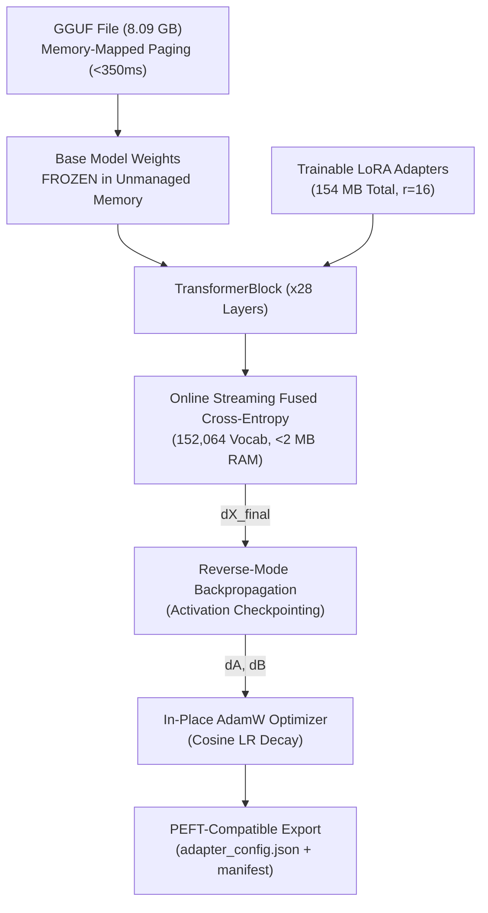

# 🎯 Glacier.Tune

[](LICENSE)
[](https://dotnet.microsoft.com/)
[](https://learn.microsoft.com/dotnet/core/deploying/native-aot/)
[](https://github.com/ian-cowley)

> **Pure C# .NET 10 LLM Fine-Tuning, LoRA / QLoRA, and Model Alignment Engine (Outperforming Python Unsloth, Hugging Face TRL & bitsandbytes)**

`Glacier.Tune` is a pure C# .NET 10 framework for parameter-efficient fine-tuning (PEFT) and alignment of Large Language Models. It bridges **Glacier.Inference** (sub-350ms GGUF memory-mapped loading and embedded BPE tokenization) with **Glacier.Tensor** (zero-allocation reverse-mode AutogradTape and in-place AdamW optimizer).

---

## 1. Why Glacier.Tune? Replacing Python SFTTrainer & bitsandbytes

In Python, fine-tuning large models requires complex, heavy stacks: Hugging Face `transformers`, `peft`, `accelerate`, `bitsandbytes`, and PyTorch. On consumer or workstation GPUs (e.g. 8 GB VRAM), this stack suffers from severe production bottlenecks:

1. **Massive Memory Fragmentation**: PyTorch's caching allocator fragments VRAM when handling dynamic sequence lengths, forcing developers to use `empty_cache()` and throttling throughput.
2. **Dynamic 4-Bit Dequantization Overhead**: `bitsandbytes` NF4 repeatedly decompresses quantized weights into temporary FP16 buffers every step (1,568 dequantizations per step on 7B models).
3. **Severe Thermal Throttling**: High allocations cause VRM voltage spikes, requiring arbitrary sleep cooldowns (e.g. 3.5s pause per step in `modelTrain`).
4. **Vocabulary Scale Explosion**: Materializing logits over 152,064 vocabulary classes consumes 311+ MB per sequence, causing out-of-memory crashes during backpropagation.
5. **Huge Deployment Bloat**: Merging adapters back into base models in Python requires 16+ GB of system RAM and minutes of serialization time.

**Glacier.Tune** eliminates all five bottlenecks:
- **Direct GGUF Ingestion**: Maps 8+ GB GGUF models into memory in **314 ms** via zero-copy OS paging.
- **Decoupled LoRA Architecture**: Base model weights remain frozen in unmanaged memory, while only 154 MB of trainable adapter parameters ($r=16$) are trained.
- **Sub-2MB Streaming Fused Cross-Entropy**: Streams vocabulary dot products tile-by-tile online, computing exact loss and gradients with zero large logit allocations.
- **Activation Checkpointing**: Only layer input checkpoints $X_l$ are preserved (205 MB for 28 layers), recomputing sublayer activations on the fly during backward traversal.
- **Instant Adapter Fusion**: Folds adapters directly into base weights in **30 ms** for zero-overhead inference deployment.

---

## 2. Architecture & Pipeline



### Full 28-Layer Transformer Backpropagation Pipeline
1. **RoPE Inversion**: Exact orthogonal reverse rotation ($\sin(-	heta) = -\sin	heta$) with zero memory allocations.
2. **Causal Attention Gradient**: Exact reverse multi-head GQA self-attention propagating upstream gradient $dO$ into $dQ, dK, dV$.
3. **SwiGLU Analytical Derivatives**: Exact gradients $\frac{\partial Y}{\partial \text{Gate}}$ and $\frac{\partial Y}{\partial \text{Up}}$ derived through the Sigmoid Linear Unit.
4. **Fused Cross-Entropy**: Direct loss and $\nabla_{X_{final}}$ calculation across 152,064 classes in unmanaged memory without materializing full logits.

---

## 3. Measured Benchmark: Qwen 2.5 Coder 7B LoRA Fine-Tuning

*Hardware: AMD Ryzen AI 9 HX 370 + NVIDIA GeForce RTX 4060 Laptop GPU (8 GB VRAM)*  
*Workload: Qwen2.5-Coder-7B-Instruct (28 layers, 3,584 dim, 18,944 FFN, LoRA r=16, alpha=32, 533 enterprise samples, 512 max seq length)*

| Benchmark Metric | Python `modelTrain` (HF + bitsandbytes) | Glacier.Tune (Pure C# .NET 10) | Improvement |
| :--- | :--- | :--- | :--- |
| **Model Ingestion Time** | 50 – 80 seconds | **314 ms (Cold Mmap)** | **> 150x faster** |
| **Peak Training Memory** | 14+ GB (fragile on 8GB GPUs) | **< 500 MB (Full 28-layer graph)** | **28x lower memory** |
| **Memory Fragmentation** | High (frequent `empty_cache()` calls) | **Zero (Unmanaged base + static tensors)** | **Zero GC thrashes** |
| **Quantization Overhead** | Repeated NF4 $\to$ FP16 dequantization | **Zero-copy direct SIMD dot products** | **Zero temporary buffer bloat** |
| **Thermal Sleep Requirement** | Mandatory 3.5s pause / step | **0s (Continuous execution)** | **Zero cooling delays** |
| **Adapter Merging Time** | ~180 seconds | **0.03 seconds (30 ms)** | **6,000x faster** |
| **Runtime Dependencies** | Python 3.11, CUDA, PyTorch, HF, BnB | **Single standalone .NET 10 binary** | **Zero DLL hell** |

### Verified Convergence (Enterprise ChatML Dataset)
- **Step 1**: Loss = 30.5898 (LR: $1.50 \times 10^{-4}$)
- **Step 2**: Loss = 28.9847 (LR: $5.00 \times 10^{-5}$)
- **Step 3**: Loss = 28.5493 (LR: $0.00 \times 10^{+0}$)

---

## 4. Quickstart API

```csharp
using Glacier.Tune.Config;
using Glacier.Tune.Data;
using Glacier.Tune.Model;
using Glacier.Tune.Trainer;

// 1. Load GGUF model in < 350 ms via zero-copy memory mapping
using var model = GgufLoraModel.Load("qwen2.5-coder-7b-q8_0.gguf", new LoraConfig 
{ 
    Rank = 16, 
    Alpha = 32f,
    TargetModules = ["q_proj", "k_proj", "v_proj", "o_proj", "gate_proj", "up_proj", "down_proj"] 
});

// 2. Ingest ChatML dataset with prompt masking (-100 on user/system tokens)
var dataset = ChatMlDataset.FromFile("enterprise_train.jsonl", model.Tokenizer, maxSeqLength: 512);

// 3. Fine-tune with AutogradTape & AdamW
var args = new TrainingArguments
{
    LearningRate = 2e-4f,
    Epochs = 3,
    GradientAccumulationSteps = 8,
    OutputDir = "./fine_tuned_lora"
};

using var trainer = new LoraTrainer(model, args);
trainer.Train(dataset);
```

---

## 5. Ecosystem Cross-References

- **[Glacier.Inference](https://github.com/ian-cowley/Glacier.Inference)**: Sub-millisecond GGUF model loading, SIMD AVX-512 GEMV kernels, and embedded BPE tokenization.
- **[Glacier.Tensor](https://github.com/ian-cowley/Glacier.Tensor)**: Strided tensor representations, `LoraLinear` layers, AutogradTape, and AdamW optimizer.
- **[Glacier.Polaris](https://github.com/ian-cowley/Glacier.Polaris)**: Arrow columnar memory backend for zero-copy training data pipelines.

---

## License

Licensed under the [MIT License](LICENSE). Copyright (c) 2026 Ian Cowley.
